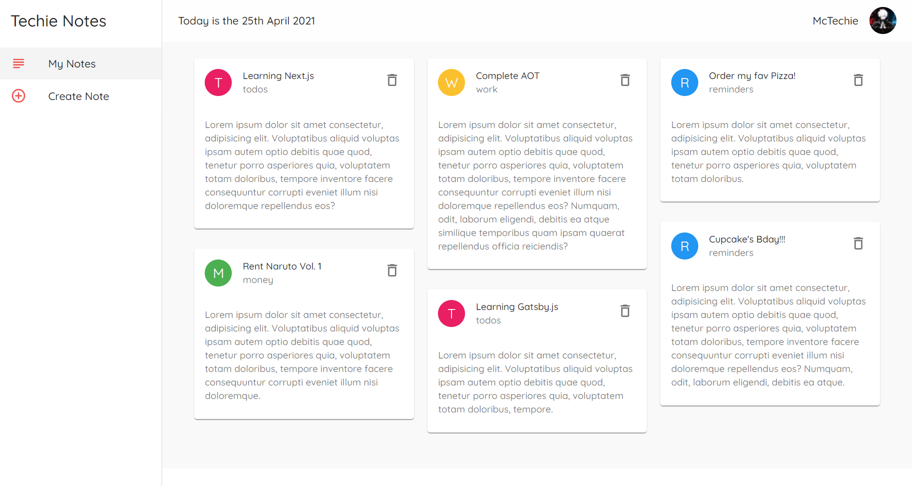

# Techie Notes

> A McTechie creation 👨‍🎨✨

### Tech Used

- [x] React
- [x] Material UI
- [x] JSON Server
- [x] Masonry Grid

> The website utilizes json-server. In order to view the deployed website kindly clone the repo and run `npm run dev` to start json-server.
> 
> OR
> 
> You may copy the `db.json` file in the `data` folder locally and run json-server manually  as `json-server --watch db.json --port 8000` and then view the deployed website.

---

### All Notes

---

### Create Notes

